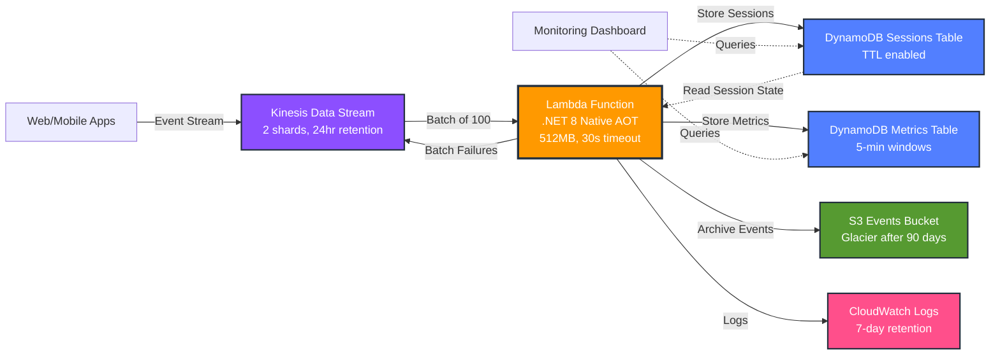

# Architecture Diagram

## Data Flow

1. **Event Ingestion**: Web and mobile applications send clickstream events to Kinesis Data Stream
2. **Batch Processing**: Lambda function processes events in batches of up to 100 records
3. **Validation & Enrichment**: Each event is validated and enriched with session data
4. **State Management**: User sessions are stored in DynamoDB with 7-day TTL
5. **Metrics Aggregation**: Real-time metrics are aggregated in 5-minute windows
6. **Event Archival**: Raw events are archived to S3 for historical analysis
7. **Partial Batch Failures**: Invalid events are reported back to Kinesis for retry
8. **Observability**: All processing is logged to CloudWatch for monitoring

## Key Features

- **Native AOT Compilation**: Cold starts < 100ms (86% improvement)
- **Batch Failure Reporting**: Only retry failed records, not entire batches
- **Session Tracking**: 30-minute timeout with automatic expiration
- **Cost Optimization**: 10-second batching window reduces invocations by 80%
- **Data Lifecycle**: S3 objects transition to Glacier after 90 days
